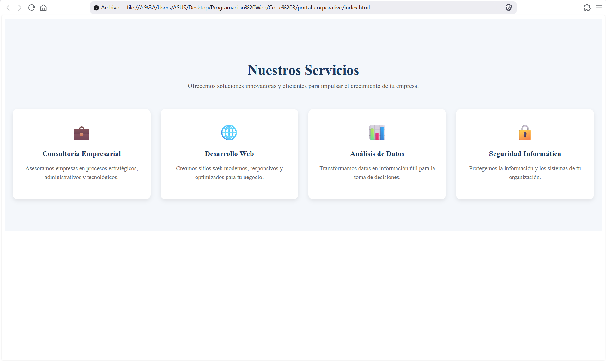
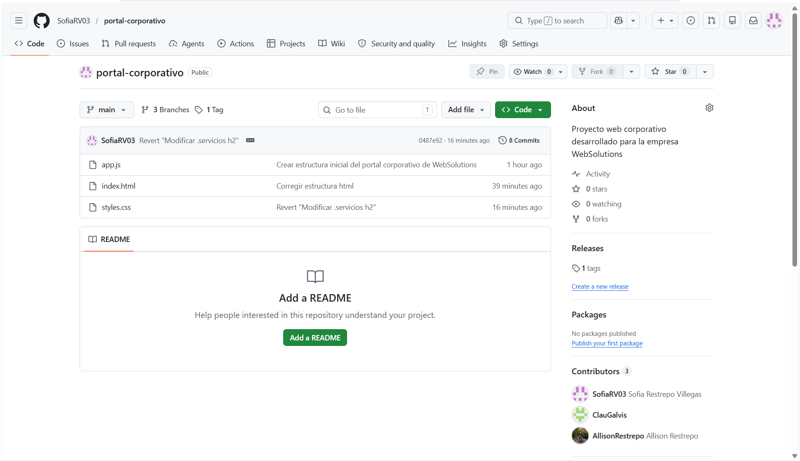

# 🏢 Portal Corporativo - Sección de Servicios

Este proyecto es una plantilla moderna y responsiva para la sección de servicios de un portal corporativo. Diseñada con un enfoque en la experiencia del usuario (UX) y una estética profesional, utiliza tecnologías web estándar para garantizar compatibilidad y rendimiento.

---

## � Vista Previa

| Vista del Sitio | Estructura del Proyecto |
| :---: | :---: |
|  |  |

---

## �🚀 Características

- **Diseño Responsivo:** Adaptable a dispositivos móviles, tablets y computadoras de escritorio mediante el uso de CSS Grid.
- **Interatividad Sutil:** Efectos de hover en las tarjetas de servicios para una navegación más dinámica.
- **Arquitectura Limpia:** Estructura de archivos organizada y fácil de mantener.
- **Estética Profesional:** Paleta de colores sobria y tipografía legible enfocada al sector empresarial.

## 🛠️ Tecnologías Utilizadas

- **HTML5:** Estructura semántica del contenido.
- **CSS3:** Estilizado avanzado con CSS Grid y transiciones suaves.
- **JavaScript:** Base preparada para futuras funcionalidades interactivas.

## 📋 Estructura del Proyecto

```text
portal-corporativo/
├── capturas/      # Carpeta de recursos visuales (Screenshots)
│   ├── repo.png   # Captura de la estructura del repositorio
│   └── sitio.png  # Captura del sitio web en funcionamiento
├── index.html     # Estructura principal del portal
├── styles.css     # Estilos y diseño visual
└── app.js         # Lógica de cliente (actualmente base para expansión)
```

## 💻 Instalación y Uso

No requiere dependencias externas ni compilación. Para visualizar el proyecto localmente:

1. Clona este repositorio o descarga los archivos.
2. Abre el archivo `index.html` en cualquier navegador web moderno.

## 🌟 Servicios Destacados

El portal actualmente muestra cuatro pilares fundamentales:
1. **💼 Consultoría Empresarial:** Asesoría estratégica.
2. **🌐 Desarrollo Web:** Creación de sitios modernos.
3. **📊 Análisis de Datos:** Información para toma de decisiones.
4. **🔒 Seguridad Informática:** Protección de activos digitales.

---
**Desarrollado como parte del curso de Programación Web por Sofia Restrepo, Allison Mariana Restrepo y Claudia Patricia Galvis**
